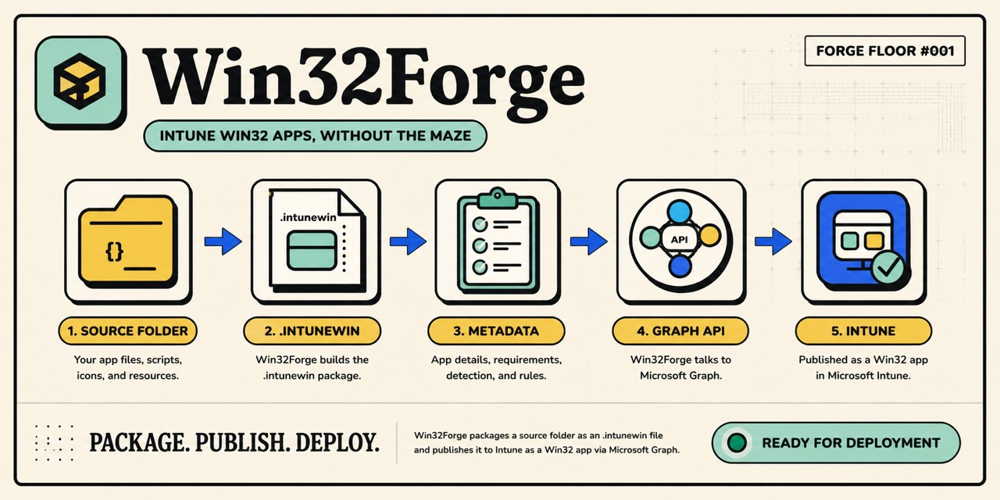

# Win32Forge

Intune Win32 apps, without the maze.

Win32Forge takes an app folder, packaging scripts, and an icon, then turns them into a ready-to-upload `.intunewin` package with the Intune metadata wired in. It handles the repeatable packaging and Microsoft Graph upload work between your source folder and Intune.

Package. Publish. Deploy.

<p align="center">
  
</p>

<p align="center">
  <a href="https://github.com/jorgeasaurus/Win32Forge/actions/workflows/ci.yml"></a>
  <a href="https://www.powershellgallery.com/packages/Win32Forge"></a>
  <a href="https://www.powershellgallery.com/packages/Win32Forge"></a>
  
  
</p>

<p align="center">
  <a href="https://github.com/jorgeasaurus/Win32Forge/stargazers"></a>
  <a href="https://github.com/jorgeasaurus/Win32Forge/commits/main"></a>
  <a href="https://github.com/jorgeasaurus/Win32Forge/releases/latest"></a>
</p>

Documentation site: <https://jorgeasaurus.github.io/Win32Forge/>

## What it handles

Win32Forge is the packaging pipeline for a Win32 app:

1. Prepare a source folder with the app payload, install script, uninstall script, detection rule, and icon.
2. Build the `.intunewin` package Intune expects.
3. Add the app name, publisher, version, install command, uninstall command, and detection rules.
4. Upload the package through Microsoft Graph so it appears in Intune as a Win32 app.

## Before publishing

You need PowerShell 7, two helper modules, and the Intune app permission. Win32Forge works on Windows and macOS; Linux should work but is not tested yet.

```powershell
Install-Module Win32Forge -Scope CurrentUser
Import-Module Win32Forge
```

```powershell
Install-Module Microsoft.Graph.Authentication, SvRooij.ContentPrep.Cmdlet -Scope CurrentUser
```

Required Graph permission: `DeviceManagementApps.ReadWrite.All`.

## Your app folder

Use one source folder with the files Win32Forge needs to package and publish the app.

```text
MyApp/
|-- install.ps1      # install command script
|-- uninstall.ps1    # uninstall command script
|-- detection.ps1    # default detection script
|-- icon.png         # Company Portal icon
`-- payload files    # application content
```

File names are configurable with parameters. See [Examples/ContosoSampleApp](Examples/ContosoSampleApp) for a working sample.

## Publish an app

### Interactive sign-in

```powershell
Publish-IntuneWin32App `
    -SourceDirectory ./Examples/ContosoSampleApp `
    -Name 'Contoso Sample App' `
    -Publisher 'Contoso' `
    -Version '1.0.0'
```

### Dry run

```powershell
Publish-IntuneWin32App `
    -SourceDirectory ./Examples/ContosoSampleApp `
    -Name 'Contoso Sample App' `
    -Publisher 'Contoso' `
    -Version '1.0.0' `
    -WhatIf
```

### Replace an existing app

Use `-Force` when replacing an existing app with the same display name.

```powershell
Publish-IntuneWin32App `
    -SourceDirectory ./Examples/ContosoSampleApp `
    -Name 'Contoso Sample App' `
    -Publisher 'Contoso' `
    -Version '1.1.0' `
    -Force
```

### Specific tenant

```powershell
Publish-IntuneWin32App `
    -SourceDirectory ./Examples/ContosoSampleApp `
    -Name 'Contoso Sample App' `
    -Publisher 'Contoso' `
    -Version '1.0.0' `
    -TenantId 'contoso.onmicrosoft.com'
```

### App-only authentication

`TenantId`, `ClientId`, and `ClientSecret` are required together.

```powershell
Publish-IntuneWin32App `
    -SourceDirectory ./Examples/ContosoSampleApp `
    -Name 'Contoso Sample App' `
    -Publisher 'Contoso' `
    -Version '1.0.0' `
    -TenantId '00000000-0000-0000-0000-000000000000' `
    -ClientId '11111111-1111-1111-1111-111111111111' `
    -ClientSecret $env:INTUNE_CLIENT_SECRET
```

### Custom scripts, icon, and output folder

```powershell
Publish-IntuneWin32App `
    -SourceDirectory ./MyApp `
    -Name 'My App' `
    -Publisher 'Contoso' `
    -Version '2.0.0' `
    -InstallScript 'deploy/install-myapp.ps1' `
    -UninstallScript 'deploy/uninstall-myapp.ps1' `
    -DetectionScript 'deploy/detect-myapp.ps1' `
    -IconFile 'assets/myapp.png' `
    -OutputDirectory ./build
```

### Keep Graph connected

```powershell
Publish-IntuneWin32App `
    -SourceDirectory ./Examples/ContosoSampleApp `
    -Name 'Contoso Sample App' `
    -Publisher 'Contoso' `
    -Version '1.0.0' `
    -KeepConnected
```

## Detection rules

Default behavior uses `detection.ps1`. Use `-DetectionRule` when you need file system, registry, product code, PowerShell script options, or a raw Graph detection rule.

### Product code detection

```powershell
Publish-IntuneWin32App `
    -SourceDirectory ./Examples/ContosoSampleApp `
    -Name 'Contoso Sample App' `
    -Publisher 'Contoso' `
    -Version '1.0.0' `
    -DetectionRule @{
        Type = 'ProductCode'
        ProductCode = '{11111111-1111-1111-1111-111111111111}'
    }
```

### PowerShell script detection

```powershell
Publish-IntuneWin32App `
    -SourceDirectory ./Examples/ContosoSampleApp `
    -Name 'Contoso Sample App' `
    -Publisher 'Contoso' `
    -Version '1.0.0' `
    -DetectionRule @{
        Type = 'PowerShellScript'
        ScriptPath = 'detection.ps1'
        EnforceSignatureCheck = $false
        RunAs32Bit = $false
    }
```

### File system detection

```powershell
Publish-IntuneWin32App `
    -SourceDirectory ./Examples/ContosoSampleApp `
    -Name 'Contoso Sample App' `
    -Publisher 'Contoso' `
    -Version '1.0.0' `
    -DetectionRule @{
        Type = 'FileSystem'
        Path = '%ProgramFiles%\Contoso'
        FileOrFolderName = 'Contoso.exe'
        DetectionType = 'exists'
        Check32BitOn64System = $false
    }
```

### Registry detection

```powershell
Publish-IntuneWin32App `
    -SourceDirectory ./Examples/ContosoSampleApp `
    -Name 'Contoso Sample App' `
    -Publisher 'Contoso' `
    -Version '1.0.0' `
    -DetectionRule @{
        Type = 'Registry'
        KeyPath = 'HKEY_LOCAL_MACHINE\Software\Contoso'
        ValueName = 'Version'
        DetectionType = 'version'
        Operator = 'greaterThanOrEqual'
        DetectionValue = '1.0.0'
    }
```

### Raw Graph detection

```powershell
Publish-IntuneWin32App `
    -SourceDirectory ./Examples/ContosoSampleApp `
    -Name 'Contoso Sample App' `
    -Publisher 'Contoso' `
    -Version '1.0.0' `
    -DetectionRule @{
        '@odata.type' = '#microsoft.graph.win32LobAppProductCodeDetection'
        productCode = '{11111111-1111-1111-1111-111111111111}'
        productVersionOperator = 'notConfigured'
        productVersion = ''
    }
```

### Multiple detection rules

```powershell
Publish-IntuneWin32App `
    -SourceDirectory ./Examples/ContosoSampleApp `
    -Name 'Contoso Sample App' `
    -Publisher 'Contoso' `
    -Version '1.0.0' `
    -DetectionRule @(
        @{
            Type = 'FileSystem'
            Path = '%ProgramFiles%\Contoso'
            FileOrFolderName = 'Contoso.exe'
            DetectionType = 'exists'
        }
        @{
            Type = 'Registry'
            KeyPath = 'HKEY_LOCAL_MACHINE\Software\Contoso'
            ValueName = 'Version'
            DetectionType = 'version'
            Operator = 'greaterThanOrEqual'
            DetectionValue = '1.0.0'
        }
    )
```

## Output

Returns an object with `DisplayName`, `Id`, `Version`, `PackagePath`, and `TenantId`.

## Parameters

| Parameter | Required | Default | Description |
|---|---|---|---|
| `SourceDirectory` | Yes | - | Folder containing the app payload and scripts |
| `Name` | Yes | - | Intune display name |
| `Publisher` | Yes | - | Publisher name |
| `Developer` | No | `Publisher` value | Developer name shown in Intune |
| `Version` | Yes | - | App version string |
| `InstallScript` | No | `install.ps1` | Install script, relative to source directory |
| `UninstallScript` | No | `uninstall.ps1` | Uninstall script |
| `DetectionScript` | No | `detection.ps1` | Default detection script |
| `DetectionRule` | No | - | Structured detection rule object(s): `PowerShellScript`, `FileSystem`, `Registry`, `ProductCode`, or raw Graph rule |
| `IconFile` | No | `icon.png` | Company Portal icon |
| `OutputDirectory` | No | temp dir | Where the `.intunewin` package is written |
| `TenantId` | No | - | Entra tenant ID; required with `ClientId`/`ClientSecret` |
| `ClientId` | No | - | App registration ID for app-only auth |
| `ClientSecret` | No | - | Client secret for app-only auth |
| `Force` | No | - | Delete and replace an existing app with the same name |
| `KeepConnected` | No | - | Skip `Disconnect-MgGraph` on completion |

## Build and release

```powershell
./build.ps1 -Task CI
```

To publish, set the `PSGALLERY_API_KEY` repository secret, update `Win32Forge.psd1`, then push a matching tag such as `v0.1.1`.
